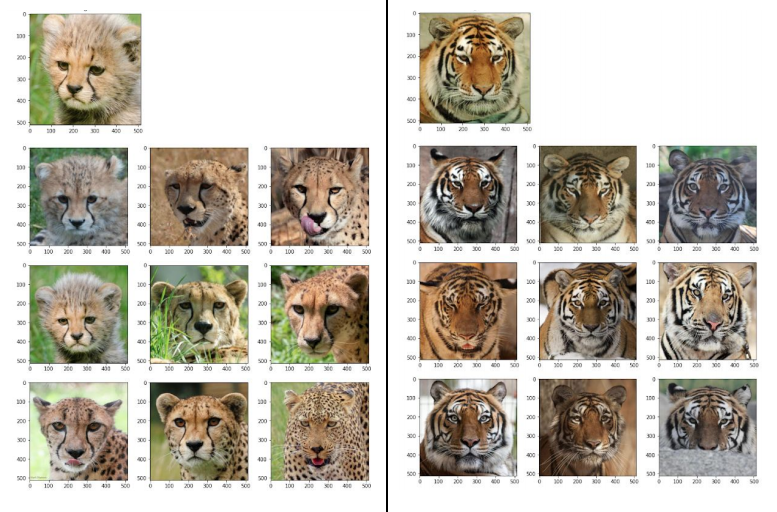

# Content-Based-Image-Retrival-using-Encoder-Decoder

Content Based Image Retrival using Encoder Decoder, my program accepts an input image and return N images from the provided dataset similar to the input image. 

In my approach, instead of compressing and reconstructing the same image using encoder-decoder, I have used denoising encoder-decoder to learn a bit more about the images to extract better features from the model, I have used salt and pepper noise for this.

I have tried different encoder-decoder with different architectures and found denoising encoder-decoder the best one (in terms of image reconstruction loss for both validation and train data). I can also try to extract invariant features using SimClr or can try context encoder, but as these approaches require heavy computational systems, I wasn’t able to try them.

---

Dataset which I have used can be found [here](https://drive.google.com/file/d/1VT-8w1rTT2GCE5IE5zFJPMzv7bqca-Ri/view).

---

### Files/Notebooks:
	train_model.ipynb             : In this notebook, I have trained the denoising encoder-decoder and at the last saved it.
	get_and_save_features.ipynb   : In this notebook, I have saved the extracted features of images present in the given dataset, along with their image index, for example. for image -> ‘120.jpg’, the image index will be 120 in data_map_salt_and_pepper.pickle
	quering_an_image.ipynb        : This notebook, return N images from the provided dataset similar to the input query image.
	utils.py                      : it has an image preprocessing function which is used in all 3 notebooks.

I have also attached the trained model and data_map_salt_and_pepper.pickle, if any of them is not working you can find them [here](https://drive.google.com/drive/folders/1nf6Q7wB8xgaOy1LSLiyvc-Ge5XnWWxcY?usp=sharing).
 
---

### Example:

	

---

#### Author   - Shubham Bindal
#### Email-id - shubhambindal610@gmail.com (you may contact for any query or improvement) 

---

I have also tried to do clustering by finding the optimal number of clusters by comparing silhouette scores for different values of the number of clusters, but the result which I was getting doesn’t seem good.
